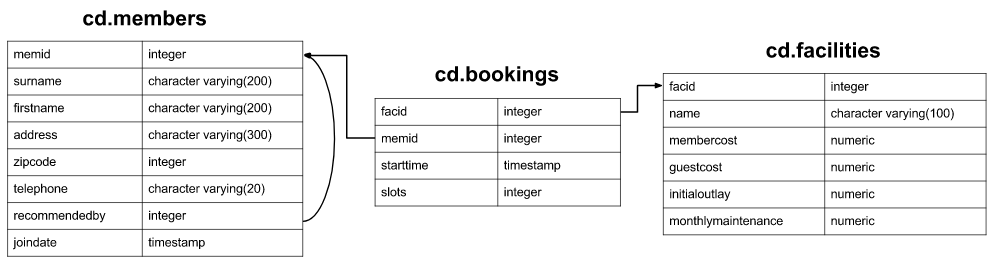

Right now, this is the result of going through PostgresSql learning exercises [PostgreSQL Exercises](https://www.pgexercises.com/). The plans are to supplement this with Java code that does similar work.

  
SQL: click to expand!

Contents of tables:
- [cd.members](./src/main/resources/cd.members.md)
- [cd.bookings](./src/main/resources/cd.bookings.md)
- [cd.facilities](./src/main/resources/cd.facilities.md)

|[Simple SQL Queries](https://www.pgexercises.com/questions/basic/)| My answers |
|:----|:----|
|    [Retrieve everything from a table](https://www.pgexercises.com/questions/basic/selectall.html)|[🔍](./src/main/resources/simple_sql_queries/retrieve_everything_from_a_table.sql)|
|    [Retrieve specific columns from a table](https://www.pgexercises.com/questions/basic/selectspecific.html)|[🔍](./src/main/resources/simple_sql_queries/retrieve_specific_columns_from_a_table.sql)|
|    [Control which rows are retrieved](https://www.pgexercises.com/questions/basic/where.html)|[🔍](./src/main/resources/simple_sql_queries/control_which_rows_are_retrieved.sql)|
|    [Control which rows are retrieved - part 2](https://www.pgexercises.com/questions/basic/where2.html)|[🔍](./src/main/resources/simple_sql_queries/control_which_rows_are_retrieved_-_part_2.sql)|
|    [Basic string searches](https://www.pgexercises.com/questions/basic/where3.html)|[🔍](./src/main/resources/simple_sql_queries/basic_string_searches.sql)|
|    [Matching against multiple possible values](https://www.pgexercises.com/questions/basic/where4.html)|[🔍](./src/main/resources/simple_sql_queries/matching_against_multiple_possible_values.sql)|
|    [Classify results into buckets](https://www.pgexercises.com/questions/basic/classify.html)|[🔍](./src/main/resources/simple_sql_queries/classify_results_into_buckets.sql)|
|    [Working with dates](https://www.pgexercises.com/questions/basic/date.html)|[🔍](./src/main/resources/simple_sql_queries/working_with_dates.sql)|
|    [Removing duplicates, and ordering results](https://www.pgexercises.com/questions/basic/unique.html)|[🔍](./src/main/resources/simple_sql_queries/removing_duplicates_and_ordering_results.sql)|
|    [Combining results from multiple queries](https://www.pgexercises.com/questions/basic/union.html)|[🔍](./src/main/resources/simple_sql_queries/combining_results_from_multiple_queries.sql)|
|    [Simple aggregation](https://www.pgexercises.com/questions/basic/agg.html)|[🔍](./src/main/resources/simple_sql_queries/simple_aggregation.sql)|
|    [More aggregation](https://www.pgexercises.com/questions/basic/agg2.html)|[🔍](./src/main/resources/simple_sql_queries/more_aggregation.sql)|

|[Joins and Subqueries](https://www.pgexercises.com/questions/joins/)| My answers |
|:----|:----|
|    [Retrieve the start times of members' bookings](https://www.pgexercises.com/questions/joins/simplejoin.html)|[🔍](./src/main/resources/joins_and_subqueries/retrieve_the_start_times_of_members_bookings.sql)|
|    [Work out the start times of bookings for tennis courts](https://www.pgexercises.com/questions/joins/simplejoin2.html)|[🔍](./src/main/resources/joins_and_subqueries/work_out_the_start_times_of_bookings_for_tennis_courts.sql)|
|    [Produce a list of all members who have recommended another member](https://www.pgexercises.com/questions/joins/self.html)|[🔍](./src/main/resources/joins_and_subqueries/produce_a_list_of_all_members_who_have_recommended_another_member.sql)|
|    [Produce a list of all members along with their recommender](https://www.pgexercises.com/questions/joins/self2.html)|[🔍](./src/main/resources/joins_and_subqueries/produce_a_list_of_all_members_along_with_their_recommender.sql)|
|    [Produce a list of all members who have used a tennis court](https://www.pgexercises.com/questions/joins/threejoin.html)|[🔍](./src/main/resources/joins_and_subqueries/produce_a_list_of_all_members_who_have_used_a_tennis_court.sql)|
|    [Produce a list of costly bookings](https://www.pgexercises.com/questions/joins/threejoin2.html)|[🔍](./src/main/resources/joins_and_subqueries/produce_a_list_of_costly_bookings.sql)|
|    [Produce a list of all members along with their recommender using no joins.](https://www.pgexercises.com/questions/joins/sub.html)|[🔍](./src/main/resources/joins_and_subqueries/produce_a_list_of_all_members_along_with_their_recommender_using_no_joins.sql)|
|    [Produce a list of costly bookings using a subquery](https://www.pgexercises.com/questions/joins/tjsub.html)|[🔍](./src/main/resources/joins_and_subqueries/produce_a_list_of_costly_bookings_using_a_subquery.sql)|

|[Modifying data](https://www.pgexercises.com/questions/updates/)| My answers |
|:----|:----|
|    [Insert some data into a table](https://www.pgexercises.com/questions/updates/insert.html)|[🔍](./src/main/resources/modifying_data/insert_some_data_into_a_table.sql)|
|    [Insert multiple rows of data into a table](https://www.pgexercises.com/questions/updates/insert2.html)|[🔍](./src/main/resources/modifying_data/insert_multiple_rows_of_data_into_a_table.sql)|
|    [Insert calculated data into a table](https://www.pgexercises.com/questions/updates/insert3.html)|[🔍](./src/main/resources/modifying_data/insert_calculated_data_into_a_table.sql)|
|    [Update some existing data](https://www.pgexercises.com/questions/updates/update.html)|[🔍](./src/main/resources/modifying_data/update_some_existing_data.sql)|
|    [Update multiple rows and columns at the same time](https://www.pgexercises.com/questions/updates/updatemultiple.html)|[🔍](./src/main/resources/modifying_data/update_multiple_rows_and_columns_at_the_same_time.sql)|
|    [Update a row based on the contents of another row](https://www.pgexercises.com/questions/updates/updatecalculated.html)|[🔍](./src/main/resources/modifying_data/update_a_row_based_on_the_contents_of_another_row.sql)|
|    [Delete all bookings](https://www.pgexercises.com/questions/updates/delete.html)|[🔍](./src/main/resources/modifying_data/delete_all_bookings.sql)|
|    [Delete a member from the cd.members table](https://www.pgexercises.com/questions/updates/deletewh.html)|[🔍](./src/main/resources/modifying_data/delete_a_member_from_the_cdmembers_table.sql)|
|    [Delete based on a subquery](https://www.pgexercises.com/questions/updates/deletewh2.html)|[🔍](./src/main/resources/modifying_data/delete_based_on_a_subquery.sql)|

|[Aggregation](https://www.pgexercises.com/questions/aggregates/)| My answers |
|:----|:----|
|    [Count the number of facilities](https://www.pgexercises.com/questions/aggregates/count.html)|[🔍](./src/main/resources/aggregation/count_the_number_of_facilities.sql)|
|    [Count the number of expensive facilities](https://www.pgexercises.com/questions/aggregates/count2.html)|[🔍](./src/main/resources/aggregation/count_the_number_of_expensive_facilities.sql)|
|    [Count the number of recommendations each member makes.](https://www.pgexercises.com/questions/aggregates/count3.html)|[🔍](./src/main/resources/aggregation/count_the_number_of_recommendations_each_member_makes.sql)|
|    [List the total slots booked per facility](https://www.pgexercises.com/questions/aggregates/fachours.html)|[🔍](./src/main/resources/aggregation/list_the_total_slots_booked_per_facility.sql)|
|    [List the total slots booked per facility in a given month](https://www.pgexercises.com/questions/aggregates/fachoursbymonth.html)|[🔍](./src/main/resources/aggregation/list_the_total_slots_booked_per_facility_in_a_given_month.sql)|
|    [List the total slots booked per facility per month](https://www.pgexercises.com/questions/aggregates/fachoursbymonth2.html)|[🔍](./src/main/resources/aggregation/list_the_total_slots_booked_per_facility_per_month.sql)|
|    [Find the count of members who have made at least one booking](https://www.pgexercises.com/questions/aggregates/members1.html)|[🔍](./src/main/resources/aggregation/find_the_count_of_members_who_have_made_at_least_one_booking.sql)|
|    [List facilities with more than 1000 slots booked](https://www.pgexercises.com/questions/aggregates/fachours1a.html)|[🔍](./src/main/resources/aggregation/list_facilities_with_more_than_1000_slots_booked.sql)|
|    [Find the total revenue of each facility](https://www.pgexercises.com/questions/aggregates/facrev.html)|[🔍](./src/main/resources/aggregation/find_the_total_revenue_of_each_facility.sql)|
|    [Find facilities with a total revenue less than 1000](https://www.pgexercises.com/questions/aggregates/facrev2.html)|[🔍](./src/main/resources/aggregation/find_facilities_with_a_total_revenue_less_than_1000.sql)|
|    [Output the facility id that has the highest number of slots booked](https://www.pgexercises.com/questions/aggregates/fachours2.html)|[🔍](./src/main/resources/aggregation/output_the_facility_id_that_has_the_highest_number_of_slots_booked.sql)|
|    [List the total slots booked per facility per month part 2](https://www.pgexercises.com/questions/aggregates/fachoursbymonth3.html)|[🔍](./src/main/resources/aggregation/list_the_total_slots_booked_per_facility_per_month_part_2.sql)|
|    [List the total hours booked per named facility](https://www.pgexercises.com/questions/aggregates/fachours3.html)|[🔍](./src/main/resources/aggregation/list_the_total_hours_booked_per_named_facility.sql)|
|    [List each member's first booking after September 1st 2012](https://www.pgexercises.com/questions/aggregates/nbooking.html)|[🔍](./src/main/resources/aggregation/list_each_members_first_booking_after_september_1st_2012.sql)|
|    [Produce a list of member names with each row containing the total member count](https://www.pgexercises.com/questions/aggregates/countmembers.html)|[🔍](./src/main/resources/aggregation/produce_a_list_of_member_names_with_each_row_containing_the_total_member_count.sql)|
|    [Produce a numbered list of members](https://www.pgexercises.com/questions/aggregates/nummembers.html)|[🔍](./src/main/resources/aggregation/produce_a_numbered_list_of_members.sql)|
|    [Output the facility id that has the highest number of slots booked again](https://www.pgexercises.com/questions/aggregates/fachours4.html)|[🔍](./src/main/resources/aggregation/output_the_facility_id_that_has_the_highest_number_of_slots_booked_again.sql)|
|    [Rank members by (rounded) hours used](https://www.pgexercises.com/questions/aggregates/rankmembers.html)|[🔍](./src/main/resources/aggregation/rank_members_by_rounded_hours_used.sql)|
|    [Find the top three revenue generating facilities](https://www.pgexercises.com/questions/aggregates/facrev3.html)|[🔍](./src/main/resources/aggregation/find_the_top_three_revenue_generating_facilities.sql)|
|    [Classify facilities by value](https://www.pgexercises.com/questions/aggregates/classify.html)|[🔍](./src/main/resources/aggregation/classify_facilities_by_value.sql)|
|    [Calculate the payback time for each facility](https://www.pgexercises.com/questions/aggregates/payback.html)|[🔍](./src/main/resources/aggregation/calculate_the_payback_time_for_each_facility.sql)|
|    [Calculate a rolling average of total revenue](https://www.pgexercises.com/questions/aggregates/rollingavg.html)|[🔍](./src/main/resources/aggregation/calculate_a_rolling_average_of_total_revenue.sql)|

|[Working with Timestamps](https://www.pgexercises.com/questions/date/)| My answers |
|:----|:----|
|    [Produce a timestamp for 1 a.m. on the 31st of August 2012](https://www.pgexercises.com/questions/date/timestamp.html)|[🔍](./src/main/resources/working_with_timestamps/generate_a_list_of_all_the_dates_in_october_2012.sql)|
|    [Subtract timestamps from each other](https://www.pgexercises.com/questions/date/interval.html)|[🔍](./src/main/resources/working_with_timestamps/subtract_timestamps_from_each_other.sql)|
|    [Generate a list of all the dates in October 2012](https://www.pgexercises.com/questions/date/series.html)|[🔍](./src/main/resources/working_with_timestamps/generate_a_list_of_all_the_dates_in_october_2012.sql)|
|    [Get the day of the month from a timestamp](https://www.pgexercises.com/questions/date/extract.html)|[🔍](./src/main/resources/working_with_timestamps/get_the_day_of_the_month_from_a_timestamp.sql)|
|    [Work out the number of seconds between timestamps](https://www.pgexercises.com/questions/date/interval2.html)|[🔍](./src/main/resources/working_with_timestamps/work_out_the_number_of_seconds_between_timestamps.sql)|
|    [Work out the number of days in each month of 2012](https://www.pgexercises.com/questions/date/daysinmonth.html)|[🔍](./src/main/resources/working_with_timestamps/work_out_the_number_of_days_in_each_month_of_2012.sql)|
|    [Work out the number of days remaining in the month](https://www.pgexercises.com/questions/date/daysremaining.html)|[🔍](./src/main/resources/working_with_timestamps/work_out_the_number_of_days_remaining_in_the_month.sql)|
|    [Work out the end time of bookings](https://www.pgexercises.com/questions/date/endtimes.html)|[🔍](./src/main/resources/working_with_timestamps/work_out_the_end_time_of_bookings.sql)|
|    [Return a count of bookings for each month](https://www.pgexercises.com/questions/date/bookingspermonth.html)|[🔍](./src/main/resources/working_with_timestamps/return_a_count_of_bookings_for_each_month.sql)|
|    [Work out the utilisation percentage for each facility by month](https://www.pgexercises.com/questions/date/utilisationpermonth.html)|[🔍](./src/main/resources/working_with_timestamps/work_out_the_utilisation_percentage_for_each_facility_by_month.sql)|

|[String Operations](https://www.pgexercises.com/questions/string/)| My answers |
|:----|:----|
|    [Format the names of members](https://www.pgexercises.com/questions/string/concat.html)|[🔍](./src/main/resources/string_operations/format_the_names_of_members.sql)|
|    [Find facilities by a name prefix](https://www.pgexercises.com/questions/string/like.html)|[🔍](./src/main/resources/string_operations/find_facilities_by_a_name_prefix.sql)|
|    [Perform a case-insensitive search](https://www.pgexercises.com/questions/string/case.html)|[🔍](./src/main/resources/string_operations/perform_a_caseinsensitive_search.sql)|
|    [Find telephone numbers with parentheses](https://www.pgexercises.com/questions/string/reg.html)|[🔍](./src/main/resources/string_operations/find_telephone_numbers_with_parentheses.sql)|
|    [Pad zip codes with leading zeroes](https://www.pgexercises.com/questions/string/pad.html)|[🔍](./src/main/resources/string_operations/pad_zip_codes_with_leading_zeroes.sql)|
|    [Count the number of members whose surname starts with each letter of the alphabet](https://www.pgexercises.com/questions/string/substr.html)|[🔍](./src/main/resources/string_operations/count_the_number_of_members_whose_surname_starts_with_each_letter_of_the_alphabet.sql)|
|    [Clean up telephone numbers](https://www.pgexercises.com/questions/string/translate.html)|[🔍](./src/main/resources/string_operations/clean_up_telephone_numbers.sql)|

|[Recursive Queries](https://www.pgexercises.com/questions/recursive/)| My answers |
|:----|:----|
|    [Find the upward recommendation chain for member ID 27](https://www.pgexercises.com/questions/recursive/getupward.html)|[🔍](./src/main/resources/recursive_queries/find_the_upward_recommendation_chain_for_member_id_27.sql)|
|    [Find the downward recommendation chain for member ID 1](https://www.pgexercises.com/questions/recursive/getdownward.html)|[🔍](./src/main/resources/recursive_queries/find_the_downward_recommendation_chain_for_member_id_1.sql)|
|    [Produce a CTE that can return the upward recommendation chain for any member](https://www.pgexercises.com/questions/recursive/getupwardall.html)|[🔍](./src/main/resources/recursive_queries/produce_a_cte_that_can_return_the_upward_recommendation_chain_for_any_member.sql)   |

